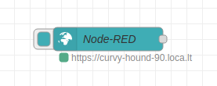
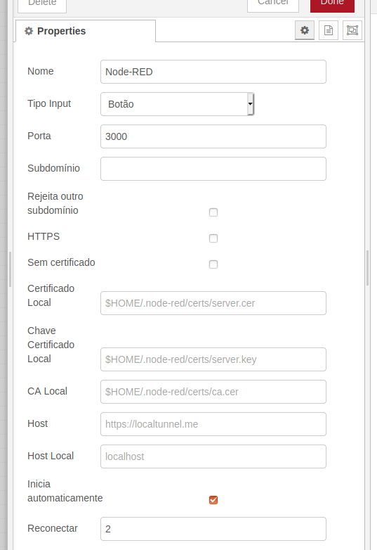

# node-red-contrib-localtunnel

This is a wrapper to expose [localtunnel](https://localtunnel.me) tunnelling service within node red.

### !!!ATTENTION!!!

You will expose local services to the internet by running this node, therefore be warned to take security precautions seriously.
